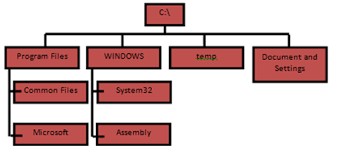
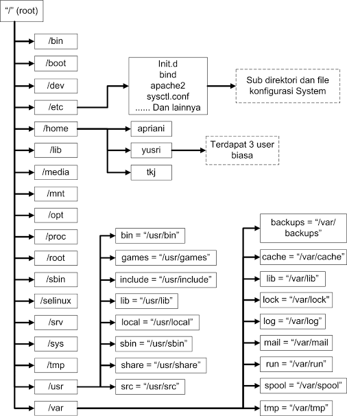

# Konsep
Sub-Materi
1. [Struktur Folder](#1-Struktur-Folder)
2. [Repository](#2-Repository)

### 1. Struktur Folder
Jika kita ingin belajar Linux lebih mendalam, hal yang paling dasar untuk dipahami adalah struktur direktorinya. Struktur direktori pada Linux sangat berbeda dengan Windows. 
#### 1.1 Struktur direktori Windows
Sistem operasi Windows memiliki struktur direktori yang sederhana dan mudah dipahami, seperti dibawah ini:  


- **Program Files** : Berfungsi untuk menyimpan program-program dan aplikasi  yang terinstal di dalam Windows
- **Windows** : menyimpan segala proses juga konten-konten utama windows. Akan terjadi kerudakan system jika ada kesalahan dalam mengatur folder ini. Isi dari folder ini berupa system32, Assembly, dan Web
- **Temp** : digunakan untuk menyimpan file-file sementara
- **Document and Settings** : berfungsi untuk menyimpan dokumen dan pengaturan-pengaturan user mulai dari desktop, start menu, dsb

#### 1.2 Struktur direktori Linux

#### 1.2.1 Struktur direktori
Pada struktur direktori Linux tidak akan ditemukan drive C, drive D, dan drive-drive lainnya karena Linux menganut satu direktori utama yaitu "**/**" (baca: root). Berikut ini adalah struktur direktori beserta apa yang berada di dalam sistem operasi Linux:



Penjelasan beberapa direktori yang perlu kalian ketahui: 
- **/** ("root") : Merupakan root atau akar dari seluruh direktori global. Partisi dimana diletakkan/ (root system) akan menjadi direktori sistem atau partisi pokok. Hanya bisa diakses oleh user root atau super user.
- **/bin** (user binaries) : Memuat program arahan yang merupakan sebagian dari sistem operasi Linux. Direktori ini meng-handle perintah standar Linux, seperti cd, ls, cp, dll.
- **/boot** (boot loader files) : Direktori yang berisi file-file yang berhubungan dengan boot loader, contohnya Grub boot manager, File Kernel initrd, vmlinux, dll.
- **/dev** (device files) : Memuat semua file penting.
- **/etc** (configuration files) : Berisi file-file konfigurasi sistem. Selain itu, juga berisi file yang dijalankan ketika start up.
- **/home** (home directories) : GNU/Linux merupakan sistem operasi yang mendukung multi-user. Kebijakannya sangat ketat. Oleh karena itu, direktori **/home** menyimpan semua direktori home user kecuali user root atau super user.
- **/lib** (system libraries) : Memuat file-file library Linux yang mendukung binary files dalam direktori **/bin** dan **/sbin**
- **/media** (removable media devices) : Direktori untuk mounting removable media seperi drive CD-ROM, hardisk eksternal, flashdisk, zip drive, dll.
- **/mnt** (mount directory) : Direktori untuk mounting file sistem sementara.
- **/opt** (optional add-on applications) : Direktori ini menyimpan file-file tambahan dari vendor-vendor tertentu. Sifatnya hanya optional. Diharapkan dengan adanya direktori ini, manajemen paket aplikasi tambahan dapat dilakukan dengan mudah.
- **/sbin** (system binaries) : Memuat file administration yang dapat diakses seperti mount, shutdown, umount.
- **/srv** (service data) : Memuat data untuk layanan (HTTP, FTP, etc.) yang ditawarkan oleh sistem.
- **/tmp** (temporary files) : Direktori yang digunakan untuk menyimpan data sementara. Isi dari direktori ini dibersihkan setiap kali sistem boot.
- **/usr** (user programs) : direktori yang berisi file-file binary, libraries, dokumentasi, dan source code dari sistem. 
- **/var** (variable files) : Memuat berbagai sistem file seperti log, direktori mail, print dan lain – lain. Yang sering kali berubah kandungannya.

Salah satu perbedaan mendasar dan mencolok antara Linux dan Windows adalah apabila kita memasuki inti dari sistem Windows (yakni System 32), kita bisa dengan bebas meng-copy atau paste file yang berada di dalamnya. Tentunya hal ini membuat Windows sangat mudah diinfeksi virus, bahkan jika kita memasang antivirus sekalipun.
Sedangkan pada Linux, jika kita ingin meng-copy, paste, atau mengedit file di dalam direktori sistem Linux (**/**, dibaca root) kita harus menggunakan super user (root) dan melakukannya file via terminal. Hal ini menyebabkan Linux menjadi sangat kebal terhadap virus.
#### 1.2.2 Absolute Path & Relative path
Setiap file dan direktori dalam filesystem Linux dapat diakses bila kita mengetahui jalur atau path direktorinya.

**Absolute Path**

Path ditulis dengan lengkap dari nama parent direktori sampai nama filenya. Misal, _/home/Penunggu/aloha.txt_ untuk meng-akses file _aloha.txt_ atau _/home/Penunggu/Downloads/_ untuk mengakses direktori.

**Relative Path**

Path tidak ditulis lengkap, tetapi berdasarkan posisi direktori yang sedang anda akses atau sering disebut direktori kerja (working directory). Misal, saat ini anda berada di direktori _/home/Penunggu_ atau "**~**" Maka cukup dituliskan aloha.txt untuk meng-akses file _aloha.txt_ atau _Downloads/_ untuk mengakses direktori. Nama working directory dapat diganti dengan sebuah tanda "**.**" ( single dot atau titik tunggal), sedangkan parent directory dapat digantikan dengan tanda "**..**" (double dot atau titik ganda).
### 2. Repository
#### 2.1. Apa itu Repository?  
   **Repository** adalah tempat menyimpan berbagai macam program atau aplikasi yang telah di buat sedemikian rupa sehigga bisa di akses melalui internet. Selain di internet, **Repository** juga tersedia di media seperti DVD sebagai alternatif **Repository** saat tak ada koneksi internet. Ketika kita melakukan download Repository melalui internet default servernya adalah server luar, seperti archive.ubuntu.com, security.ubuntu.com, dll. Untuk Fungsinya, disini Repository berperan sebagai penyedia aplikasi atau kumpulan paket software dari distro-distro linux, yang dapat di akses melalui internet.  
  
#### 2.2. Dimana file Repository itu berarda?  
File Repository ini langsung otomatis berada di laptop atau PC kita saat kita sudah menginstall linux dengan nama file biasanya "sources.list", terletak di folder apt di dalam folder etc. Jika ingin melihat Repository milik kita hanya perlu mengetikan :  

```sh
$ sudo gedit /etc/apt/sources.list
```

Kita bisa melakukan edit seperti menambah, menghapus, mengganti Repostitory milik kita sesuai yang kita inginkan.  
  
#### 2.3. Apakah Repository itu Penting?  
Adanya Repository di linux itu sangatlah _**Penting**_, karena itu adalah tempatnya paket-paket software untuk linux itu sendiri, kita hanya perlu langsung menginstall tanpa harus cari lagi paket softwarenya karena sudah tersedia di Repository tersebut. walau pun kita bisa juga mencari paket softwarenya secara manual dan menginstallnya juga, tetapi cara tersebut cukup ribet dan akan banyak memakan waktu. 
  
#### 2.4. Apakah semua Paket software ada di Repository? 
Tidak semua paket software langsung ada di repository, itu sebabnya kita harus tau nama file repository dan letaknya dimana, karena jika kita akan menginstall suatu software dan aplikasi, kemudian di Repository ternyata paketnya belum ada, kita bisa mencari repositorynya dan menambahkannya di di Repository kita dengan mengedit file sources.list tadi, yang berada di directory sudo gedit /etc/apt/sources.list.

##### Referensi
- http://2010183ifunsika.blogspot.com/2012/10/analisis-struktur-sistem-linux-dan.html
- http://www.belkomindo.com/2015/12/apasih-repository-itu.html
- http://kuntoaji.blogspot.com/2008/08/absolute-path-relative-path.html