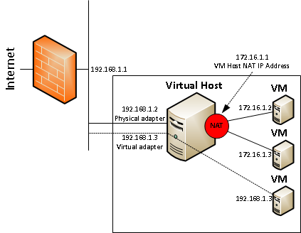
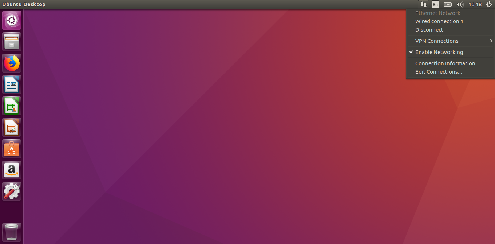
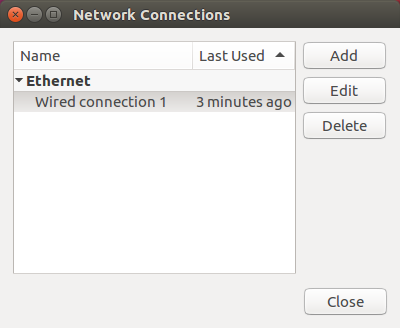
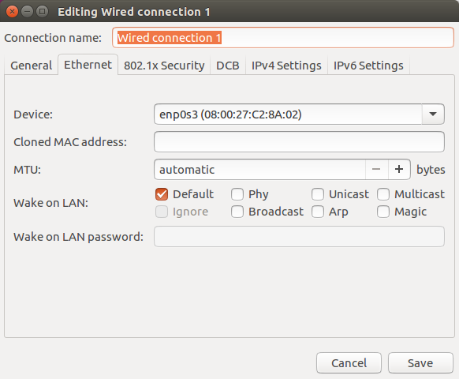
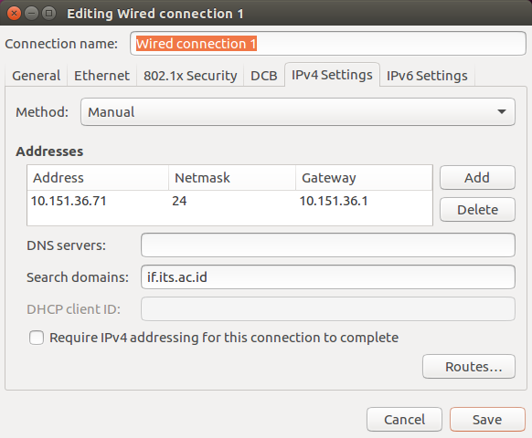

# Networking

- [1. VirtualBox Networking Modes](#1-VirtualBox-Networking-Modes)
- [2. Bridged Networking vs NAT](#2-Bridged-Networking-vs-NAT)
- [3. Setting IP Address Statis](#3-Setting-IP-Address-Statis)
  - [a. GUI](#a-GUI)
  - [b. CLI](#b-CLI)
- [4. SSH dan Telnet](#4-SSH-Telnet)

### 1. VirtualBox Networking Modes

- Not attached
  Dalam mode ini, Oracle VM VirtualBox melaporkan kepada sistem operasi guest bahwa network card ada tetapi tidak terkoneksi.

- Network Address Translation (NAT)
  Dalam mode ini, koneksi akan menggunakan IP lokal hanya untuk VM VirtualBox saja, sedangkan untuk koneksi ke internet akan menggunakan IP komputer asli. Koneksi yang masuk ke VM VirtualBox kemudian akan ditranslasi menjadi IP lokal lagi.

- NAT Network
  Layanan Network Address Translation (NAT) bekerja dengan cara yang mirip dengan router rumah, mengelompokkan sistem yang menggunakannya ke dalam jaringan dan mencegah sistem di luar jaringan ini dari secara langsung mengakses sistem di dalamnya, tetapi membiarkan sistem di dalam berkomunikasi satu sama lain dan dengan sistem di luar menggunakan TCP dan UDP melalui IPv4 dan IPv6.

- Bridged networking
  Saat diaktifkan, Oracle VM VirtualBox menyambungkan ke salah satu kartu jaringan yang terpasang dan bertukar paket jaringan secara langsung, menghindari tumpukan jaringan sistem operasi host Anda.

- Internal networking
  Ini dapat digunakan untuk membuat berbagai jenis jaringan berbasis perangkat lunak yang dapat dilihat oleh mesin virtual yang dipilih, tetapi tidak untuk aplikasi yang berjalan di host atau ke dunia luar.

- Host-only networking
  Ini dapat digunakan untuk membuat jaringan yang berisi host dan satu set mesin virtual, tanpa perlu antarmuka jaringan fisik host. Sebagai gantinya, antarmuka jaringan virtual, mirip dengan antarmuka loopback, dibuat pada host, menyediakan konektivitas antara mesin virtual dan host.

- Generic networking
  Mode yang jarang digunakan yang berbagi antarmuka jaringan generik yang sama, dengan memungkinkan pengguna untuk memilih driver yang dapat dimasukkan dengan Oracle VM VirtualBox atau didistribusikan dalam paket ekstensi.

  

### 2. Bridged Networking vs NAT



Dalam diagram ini, garis vertikal di sebelah firewall merepresentasikan jaringan produksi dan kita dapat melihat bahwa 192.168.1.1 adalah alamat IP firewall _organisasi_ yang menghubungkannya ke Internet. Ada juga virtual host dengan tiga mesin virtual yang berjalan di dalamnya. Lingkaran merah mewakili adaptor virtual yang menghubungkan mesin virtual NAT (172.16.1.1). Kita dapat melihat bahwa ada dua mesin virtual seperti itu dengan alamat IP 172.16.1.2 dan 172.16.1.3. Saat kita mengonfigurasi mesin virtual yang menggunakan NAT, ia tidak melihat jaringan _organisasi_ secara langsung. Bahkan, semua lalu lintas yang berasal dari mesin virtual akan menggunakan alamat IP host VM. Di belakang layar, lalu lintas dari mesin virtual diarahkan pada virtual host dan dikirim melalui adaptor fisik host dan, akhirnya, ke Internet.

  

Mesin virtual ketiga (192.168.1.3) dikonfigurasi dalam mode “**bridged**” yang pada dasarnya berarti bahwa adaptor jaringan virtual dalam mesin virtual tersebut dijembatani ke jaringan _organisasi_ dan mesin virtual itu beroperasi seolah-olah ada langsung di jaringan _organisasi_. Seperti mesin virtual berbasis NAT yang tidak dapat melihat jaringan _organisasi_, begitu juga sebalikya, mesin virtual dengan mode bridged network tidak dapat melihat dua mesin virtual berbasis NAT.

  

### 3. Setting IP Address Statis
##### A. GUI
1. klik ikon koneksi, lalu pilih 'edit'.



2. pilih 'wired connection 1' dan klik tombol 'edit'



3. pilih tab 'IPv4 Settings'



4. ubah metodenya menjadi manual, serta tambahkan alamat baru yang kita inginkan, serta atur DNS server serta search domain sesuai kebutuhan.



5. untuk mengaplikasikan perubahan silahkan lakukan koneksi ulang.

##### B. CLI
1.  ubah file **/etc/network/interfaces** dengan cara memasukkan command di bawah ini ke terminal :
```
$ sudo nano /etc/network/interfaces
```
2. ubah isi file menjadi
```
auto <interface>
iface <interface> inet static
address <ip static>
netmask 255.255.255.0
gateway 10.151.36.1
dns-search if.its.ac.id
```
3. setelah merubah isi file interfaces restart service networking kalian dengan menjalankan command berikut
```
$ sudo service networking restart
```


### 3. SSH dan Telnet
##### A. Telnet
Telnet adalah protokol jaringan yang memungkinkan pengguna untuk berkomunikasi dengan perangkat jarak jauh. Ini adalah protokol terminal virtual yang sebagian besar digunakan oleh administrator jaringan untuk mengakses dan mengelola perangkat dari jarak jauh. Administrator dapat mengakses perangkat dengan melakukan telnetting ke alamat IP atau nama host dari perangkat jarak jauh.

Untuk menggunakan telnet, Anda harus menginstal perangkat lunak (klien Telnet). Pada perangkat jarak jauh, server Telnet harus diinstal dan dijalankan. Telnet menggunakan port TCP 23 secara default.

Salah satu kelemahan terbesar dari protokol ini adalah bahwa semua data, termasuk nama pengguna dan kata sandi, dikirim dalam teks yang jelas (tidak terenkripsi), yang merupakan risiko keamanan potensial. Ini adalah alasan utama mengapa Telnet jarang digunakan saat ini dan digantikan oleh protokol yang jauh lebih aman yang disebut SSH. Di sini Anda dapat menemukan informasi tentang pengaturan akses Telnet pada perangkat Cisco Anda.

##### B. SSH
SSH adalah protokol jaringan yang digunakan untuk mengakses dan mengelola perangkat dari jarak jauh. Perbedaan utama antara Telnet dan SSH adalah SSH menggunakan enkripsi, yang berarti bahwa semua data yang dikirimkan melalui jaringan aman dari penyadapan. SSH menggunakan enkripsi public key untuk tujuan seperti itu.

Seperti Telnet, pengguna yang mengakses perangkat jarak jauh harus menginstal klien SSH. Pada perangkat jarak jauh, server SSH harus diinstal dan dijalankan. SSH menggunakan port TCP 22 secara default.


##### Referensi :
- https://www.virtualbox.org/manual/ch06.html#networkingmodes
- http://techgenix.com/nat-vs-bridged-network-a-simple-diagram-178/
- https://www.virtualbox.org/manual/ch06.html#networkingmodes
- https://study-ccna.com/telnet-ssh/
