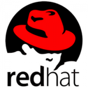
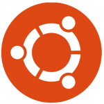

# Pengenalan
Sub-materi
1. [Pengertian Linux](#1-pengertian-linux)
2. [Distro Linux](#2-distro-linux)
3. [Perbedaan Linux, MAC, dan Windows](#3-perbedaan-linux-mac-dan-windows)

### 1. Pengertian Linux
**Linux** adalah nama yang diberikan kepada sistem operasi bertipe Unix. Linux merupakan salah satu contoh hasil pengembangan perangkat lunak bebas dan sumber terbuka utama. Seperti perangkat lunak bebas dan sumber terbuka lainnya pada umumnya, kode sumber Linux dapat dimodifikasi, digunakan dan didistribusikan kembali secara bebas oleh siapa saja.

### 2. Distro Linux
**Distro Linux** (singkatan dari **distribusi Linux**) adalah sebutan untuk sistem operasi komputer dan aplikasinya, merupakan keluarga yang menggunakan kernel Linux.

**1. Red Hat**  
  
Red Hat ini merupakan salah satu Distro Linux yang dikembangkan oleh salah satu perusahaan bernama Red Hat Inc dan seringkali juga disebut Red Hat Linux namun pada tahun 2003 diganti menjadi Red Hat Enterprise Linux khusus untuk lingkungan perusahaan. Sistem operasi yang satu ini juga yang pertama kali mempopulerkan penggunaan sistem _RPM Package Manager_.

**2. CentOS**  
  
CentOS merupakan singkatan dari _Community Enterprise Operating System_dan merupakan salah satu contoh Distro Linux yang dikembangkan oleh The CentOS Project. Sistem operasi ini dibuat menggunakan kode sumber yang berasal dari Red Hat. Oleh karena itu, dalam hal produk CentOs ini sangatlah mirip dengan Red Hat Enterprise Linux.

**3. Fedora**  
  
Fedora ini merupakan salah satu Distro Linux yang dkembangkan karena disponsori dan didukung oleh Red Hat namun dibuat oleh tim khusus bernama Fedora Project. Bahkan nama Fedora ini diambil dari salah satu karakter dalam logo Red Hat itu sendiri. Sama halnya dengan Red Hat, sistem operasi Fedora juga menggunakan sistem _RPM Package Manager_.

**4. openSUSE**  
  
openSUSE ini juga termasuk salah satu sistem operasi yang didirikan diatas kernel Linux atau biasa disebut Distro Linux. openSUSE Project selaku pihak pengembang menciptakan sistem operasi ini dengan tujuan agar penggunaan Linux dapat lebih maju dengan kinerjanya yang stabil dan ramah pengguna. openSUSE ini lebih sering digunakan sebagai sistem operasi desktop/ server.

**5. Mandrake (Mandriva)**  
  
Sistem operasi Mandrake atau yang juga bisa disebut Mandriva Linux merupakan salah satu jenis Distro Linux yang kali ini dikembangkan oleh suatu perusahaan bernama Mandriva. Sama halnya dengan Fedora, sistem operasi Mandrake ini juga menggunakan sistem _RPM Package Manager_.

**6. Debian**  
  
Proses penamaan dari salah satu Distro Linux ini bisa dibilang cukup unik. Sang pencetus pertama kali yakni Ian Murdock memberi nama Debian karena merupakan kombinasi dari namanya dan mantan kekasihnya. Salah satu alasan mengapa Debian ini termasuk Distro Linux yang paling banyak digunakan adalah karena security-nya yang bagus .

**7. Ubuntu**  
  
Ubuntu merupakan suatu sistem operasi yang berbasiskan pada Debian dan dikembangkan oleh suatu perusahaan dari Afrika Selatan yang bernama _Canonical ltd_. Asal penamaan dari Ubuntu ini juga berasal dari bahasa Afrika Selatan yang berarti kemanusiaan. Dengan sifatnya sebagai OS open source, Ubuntu sengaja diprioritaskan untuk kepentingan umum atau server.

**8. Mint**  
  
Jika sebelumnya anda mengetahui bahwa Distro Linux yang bernama Ubuntu dibuat dengan berbasiskan pada Debian, maka kali ini ada Distro Linux yang berbasiskan pada Debian dan Ubuntu. Namanya adalah Mint atau yang biasa disebut Linux Mint.

**9. Zorin**  
  
Zorin ini merupakan salah satu Distro Linux yang memiliki tampilan grafis sangat mirip dengan Windows, bahkan termasuk pada aplikasi – aplikasinya. Sejak awal tujuan pembuatan sistem operasi ini memang agar para pengguna yang terbiasa dengan Windows dapat menikmati fitur dari Linux tanpa harus mengalami kesulitan.

### 3. Perbedaan Linux, MAC, dan Windows
 
| ASPEK | LINUX | MAC | WINDOWS |  
|---|---|---|---|
| Kemanan | Memiliki tingkat keamanan paling kuat | Sulit terkena virus | Rentan terkena virus |  
| Ekonomis / Harga | Gratis | Berbayar | Berbayar |  
| Tampilan | Tampilan pada Linux sangat mudah dimengerti oleh penggunanya, tetapi tidak unggul dalam grafis | Segi tampilan Macintosh paling bagus dari Windows dan Linux, desain dan stylenya tampak sangat premium dan indah dimata konsumen | Windows unggul dalam segi grafis, memiliki tampilan yang bagus dan mudah dimengerti oleh peggunanya |  
| Performance | Performa linux sangat tinggi karena detail yang disediakan dari UI sedikit sehingga digunakan untuk embedded system karena performanya bagus dan sedikit memakan resources | High performance, dengan prosesor Intel terbaru dan inovasi terbaik lainnya, Mac dapat melakukan semua hal yang hanya dapat dilakukan Mac – dengan kecepatan yang menakjubkan | Performa lumayan baik tetapi dengan rentannya terhadap virus membuat performanya tidak maksimal sehingga cenderung lambat karena terlalu banyak detail pada UI yang menyebabkan meningkatnya ukuran Windows secara tidak langsung yang menghambat proses komputer |  
| User | Banyak user yang belum terbiasa menggunakan linux dan lumayan sulit untuk dipelajari | User-Friendly, dengan tampilan GUI yang sangat menarik, menmbuat Mac OS menjadi  salah satu OS yang banyak diminati khususnya oleh para graphic desainer | Paling disukai karena lebih mudah dipakai dan hampir digunakan oleh mayoritas pengguna komputer di dunia |  
User Interface | Memiliki banyak user interface | Tidak memiliki banyak user interface, tetapi sudah lebih mudah dipakai dan tampilannya menarik | Tidak memiliki banyak user interface |  
| Kelengkapan Program | Sudah terdapat banyak program yang siap untuk dipakai | Sudah terdapat program yang siap dipakai, tapi tidak terlalu banyak | Pertama kali memakai harus mengisi program aplikasi yang lain |  
Perangkat Lunak yang Bisa Dipakai | Sangat minim software karena sedikit developer yang membuat software di Linux | Macintosh masih kalah dibanding Windows tetapi lebih unggul dari Linux, karena software dan hardware-nya harus memiliki licence dari Apple, sedangkan Windows didukung dari berbagai vendor software dan hardware | Memiliki banyak software yang bisa dipakai karena para developer lebih memilih mengembangkan softwarenya di Windows yang pembuatannya mudah dan banyak yang memakai |  
| Pilihan sitem operasi | Linux banyak jenis yang bisa kita pilih baik lokal maupun luar | Macintosh tidak terlalu banyak yang yang disediakan | Windows tidak banyak varian/jenis yang di tawarkan |  
| Segi hardware | Ada beberapa hardware yang tidak bekerja atau belum maksimal karena ada vendor yg tidak tidak menyediakan driver versi Linux | Mac tidak bisa dirakit sendiri karena Apple sudah tidak memberi license buat perusahaan lain untuk membuat hardware yang bisa menggunakan Mac OS | Di Windows, biasanya Anda tidak pernah mendengar masalah hardwre, karena hampir semua hardware yang ada sudah menyertakan drivernya |  
 
##### Referensi :
- http://ayukhusnulkhotimah.web.ugm.ac.id/2018/03/04/perbandingan-linux-mac-os-window/
- https://www.nesabamedia.com/distro-linux/
- https://id.wikipedia.org/wiki/Linux
- https://id.wikipedia.org/wiki/Distribusi_Linux
